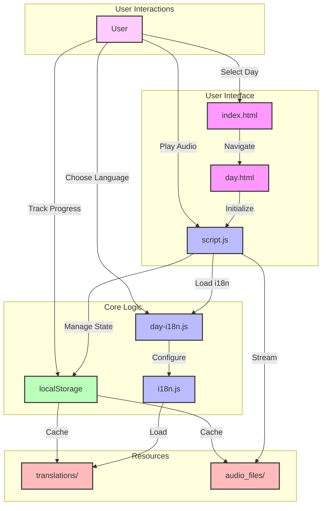
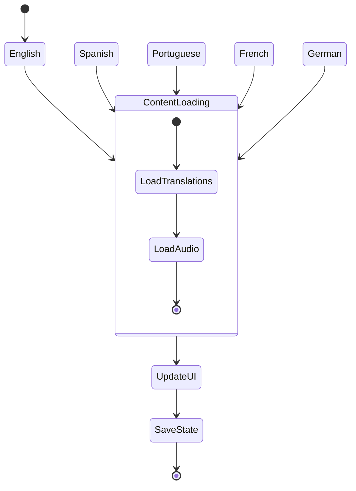
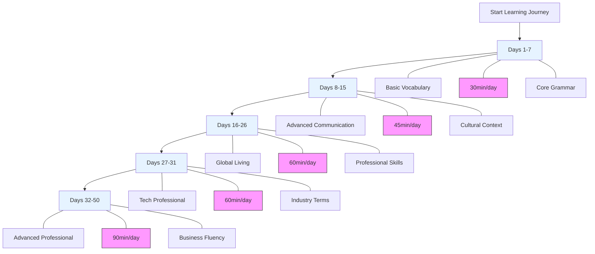
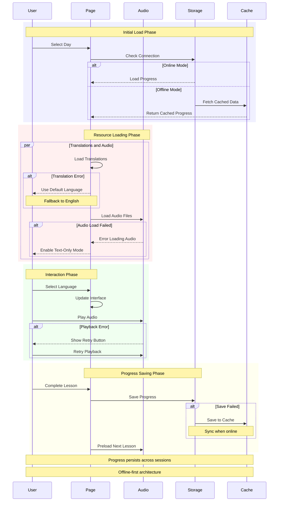

# Polyglot Pathways: Multilingual Learning Platform

## Overview
Polyglot Pathways is an innovative, interactive web application designed to facilitate comprehensive language learning across five languages: English, Spanish, Portuguese, French, and German. The platform offers a structured 50-day program that combines cutting-edge web technologies with sophisticated internationalization techniques.

## Project Structure


```
polyglot-pathways/
│
├── index.html           # Main dashboard with language progress tracking
├── day.html             # Daily lesson interface
│
├── js/                  # JavaScript modules
│   ├── i18n.js          # Internationalization core
│   ├── day-i18n.js      # Day-specific internationalization
│   ├── language-selector.js  # Dynamic language switching
│   └── script.js        # Core application logic
│
├── css/                 # Stylesheets
│
├── audio_files/         # Multilingual audio content
│   └── day*_*.mp3       # Audio files for each day and language
│
├── text_files/          # Text transcripts
│
├── translations/        # Language resource files
│
└── language_phrases_days_*.py  # Content generation scripts
```

## Key Technologies and Skills Demonstrated

### 1. Web Development
- Modern HTML5 and CSS
- Vanilla JavaScript with modular architecture
- Responsive, mobile-friendly design
- Client-side rendering
- localStorage for state management

### 2. Internationalization (i18n)
- Dynamic multilingual support
- Seamless language switching
- Comprehensive translation management
- Support for 5 languages:
  - 🇬🇧 English
  - 🇪🇸 Spanish
  - 🇧🇷 Portuguese
  - 🇫🇷 French
  - 🇩🇪 German


### 3. Educational Technology
- Structured 50-day learning curriculum
- Progressive learning path
- Interactive lesson interfaces
- Multimedia learning approach (text + audio)

### 4. Content Generation
- Python-based content generation scripts
- Systematic content organization
- Scalable content management

### 5. Audio Processing
- Multilingual audio file management
- Text-to-speech integration
- Cross-language audio content

## Course Structure



### Learning Phases
1. **Basic Vocabulary (Days 1-7)**
   - Fundamental communication skills
   - Core grammar and phrases

2. **Advanced Communication (Days 8-15)**
   - Professional and cultural expressions
   - Complex conversation techniques

3. **Global Living (Days 16-26)**
   - Professional and daily life vocabulary
   - Cross-cultural communication skills

4. **Tech Professional Content (Days 27-31)**
   - Industry-specific terminology
   - Digital communication skills

5. **Advanced Professional Skills (Days 32-50)**
   - Academic and business communication
   - Complex negotiation techniques

## Technical Requirements
- Modern web browser
- JavaScript enabled
- No additional server setup required

## Development Setup
```bash
# No installation required
# Simply open index.html in a web browser
```

## Features


- Interactive web interface
- Progress tracking
- Multilingual content
- Audio playback
- Copy-to-clipboard functionality
- Responsive design
- localStorage-based session persistence

## Global Impact
- Communicate with ~2 billion people
- Access to international job markets
- Enhanced cross-cultural communication skills

## License
This project is licensed under the MIT License - see the [LICENSE](LICENSE) file for details.

## Contributing
We welcome contributions! Please see our [Contributing Guidelines](CONTRIBUTING.md) for details on:
- Reporting bugs
- Suggesting enhancements
- Code contributions
- Documentation improvements
- Translation contributions
- Pull request process

All contributors must adhere to our [Code of Conduct](CODE_OF_CONDUCT.md).

## 👤 Author & Maintainer

This repository is maintained by [Donnivis Baker](https://github.com/dbsectrainer). For questions or feedback, please open an issue or reach out directly.
