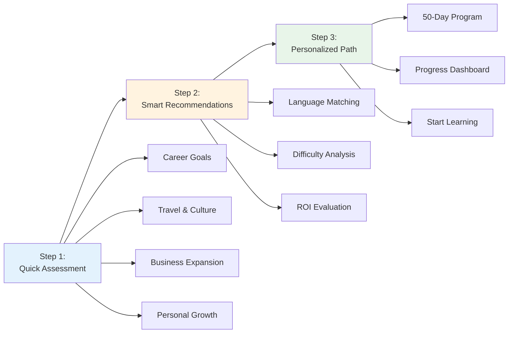
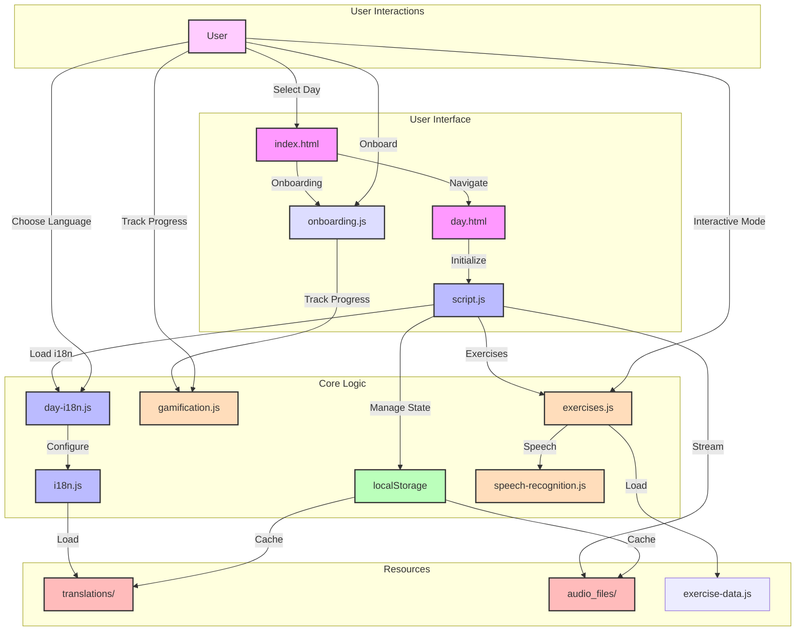
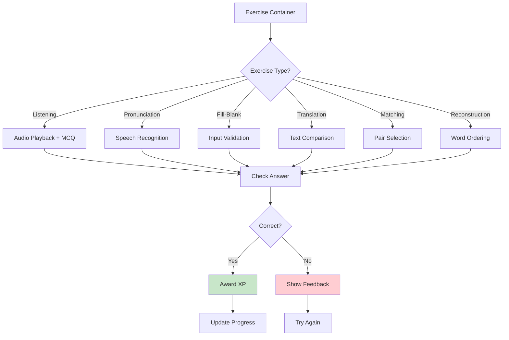
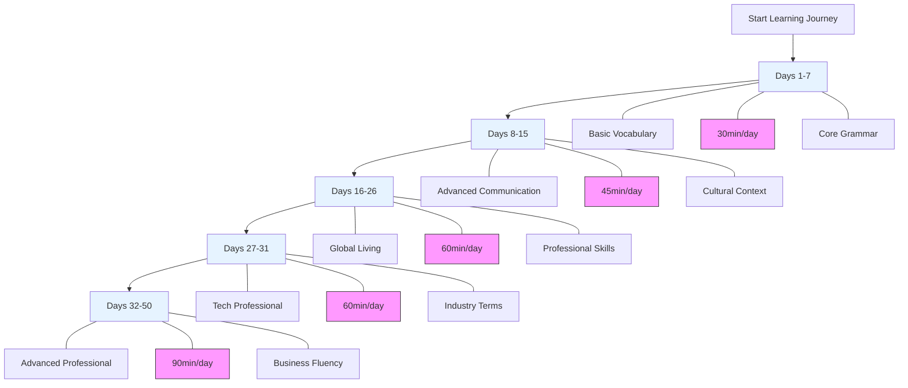
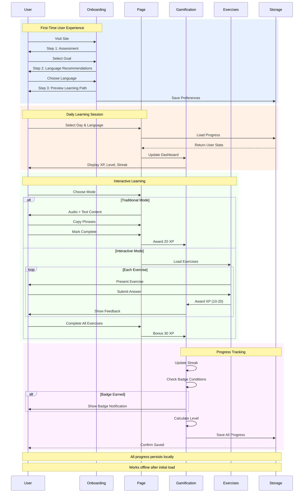

# Polyglot Pathways: Multilingual Learning Platform

[](LICENSE)
[](https://github.com/dbsectrainer/PolyglotPathways/actions/workflows/ci.yml)
[](https://github.com/dbsectrainer/PolyglotPathways)

## 🎉 Recent Updates

**Version 2.0 - Enhanced Interactive Learning Platform**

- ✅ **Progressive Onboarding**: 3-step personalized setup for new users
- ✅ **Gamification System**: XP, levels, badges, and streak tracking
- ✅ **Interactive Exercises**: 6 exercise types with real-time feedback
- ✅ **Speech Recognition**: Web Speech API integration for pronunciation
- ✅ **Dual Learning Modes**: Traditional audio/text + Interactive exercises
- ✅ **Progress Dashboard**: Comprehensive visualization of learning progress
- ✅ **Smart Recommendations**: Goal-based language suggestions
- ✅ **Enhanced UX**: Smooth animations, better navigation, mobile-optimized

## Overview
Polyglot Pathways is an innovative, interactive web application designed to facilitate comprehensive language learning across five languages: English, Spanish, Portuguese, French, and German. The platform offers a structured 50-day program that combines cutting-edge web technologies with sophisticated internationalization techniques, gamification elements, and interactive exercises to create an engaging learning experience.

## Core Features

### 🎯 Progressive Onboarding System
A 3-step guided journey that personalizes the learning experience:



**Assessment Categories:**
- **Career Advancement**: Languages for professional opportunities
- **Travel & Culture**: Connect with people worldwide
- **Business Expansion**: Enter new global markets
- **Personal Growth**: Intellectual challenge and development

### 🎮 Gamification System
Comprehensive progress tracking and motivation system:

**XP & Leveling:**
- Earn XP for completing lessons and exercises
- Progressive level system (Level 1-20+)
- XP requirements: 250 XP → Level 2, increases by 150 per level
- Visual progress bars showing advancement to next level

**Achievement Badges:**
- **First Steps**: Complete your first lesson
- **Dedicated Learner**: Maintain a 7-day streak
- **Pronunciation Master**: Perfect score on pronunciation exercises
- **Speed Demon**: Complete exercises in record time
- **Completionist**: Finish all exercises in a day
- **Polyglot**: Start learning multiple languages
- 20+ unique badges to unlock

**Streak System:**
- Daily learning streak tracking
- Automatic streak updates on lesson completion
- Visual streak counter with fire icon
- Encourages consistent daily practice

**Progress Dashboard:**
- Total XP earned
- Current level and progress to next level
- Active streak count
- Badges earned
- Per-language completion tracking

### 🎓 Dual Learning Modes
Flexible learning approaches to suit different styles:

**Traditional Mode:**
- Audio lessons with native pronunciation
- Text transcripts with organized sections
- Copy-to-clipboard functionality for phrases
- Self-paced learning
- Mark as complete when ready

**Interactive Mode:**
- 6 different exercise types
- Real-time feedback
- Speech recognition for pronunciation
- Gamified XP rewards
- Progressive difficulty

## Project Structure


```
polyglot-pathways/
│
├── index.html           # Main dashboard with onboarding & progress tracking
├── day.html             # Daily lesson interface with dual modes
│
├── js/                  # JavaScript modules
│   ├── i18n.js          # Internationalization core
│   ├── day-i18n.js      # Day-specific internationalization
│   ├── language-selector.js  # Dynamic language switching
│   ├── script.js        # Core application logic
│   ├── onboarding.js    # 3-step progressive onboarding system
│   ├── gamification.js  # XP, levels, badges, and streak tracking
│   ├── exercises.js     # Interactive exercise management
│   ├── exercise-data.js # Exercise content for all days/languages
│   ├── speech-recognition.js  # Web Speech API integration
│   └── ui-utils.js      # Shared UI utilities
│
├── css/                 # Stylesheets
│   ├── styles.css       # Main application styles
│   └── onboarding.css   # Onboarding-specific styles
│
├── audio_files/         # Multilingual audio content
│   └── day*_*.mp3       # Audio files for each day and language
│
├── text_files/          # Text transcripts
│   └── day*_*.txt       # Lesson content for each day/language
│
├── translations/        # Language resource files
│
└── language_phrases_days_*.py  # Content generation scripts
```

## 🎯 Interactive Exercise System

The platform features 6 distinct exercise types designed to reinforce different aspects of language learning:

### Exercise Types

**1. Listening Comprehension**
- Listen to native audio clips
- Multiple-choice questions
- Tests comprehension and recognition
- Awards: 15 XP per correct answer

**2. Pronunciation Practice**
- Powered by Web Speech API
- Real-time speech recognition
- Instant feedback on pronunciation accuracy
- Percentage-based scoring
- Awards: 20 XP for accurate pronunciation

**3. Fill-in-the-Blank**
- Complete sentences with missing words
- Context-based vocabulary practice
- Immediate validation
- Awards: 10 XP per correct answer

**4. Translation Exercises**
- Translate sentences between languages
- Flexible answer validation
- Builds active vocabulary
- Awards: 15 XP per correct translation

**5. Matching Exercises**
- Match words with their translations
- Interactive drag-and-drop or click-to-match
- Visual memory reinforcement
- Awards: 10 XP per successful match

**6. Sentence Reconstruction**
- Rearrange scrambled words to form sentences
- Tests grammar and word order understanding
- Progressive difficulty
- Awards: 20 XP for correct reconstruction



### Exercise Features
- **Navigation**: Previous/Next buttons to move between exercises
- **Progress Tracking**: "Exercise X of Y" counter
- **XP Rewards**: Immediate feedback with XP gains
- **Completion Bonus**: Extra XP for completing all exercises in a lesson
- **Adaptive Difficulty**: Exercises matched to lesson content
- **Multi-language Support**: Exercises available for all 5 languages

## Key Technologies and Skills Demonstrated

### 1. Web Development
- Modern HTML5 and CSS3 with custom properties
- Vanilla JavaScript with ES6+ features
- Modular architecture with class-based components
- Responsive, mobile-friendly design
- Client-side rendering with dynamic DOM manipulation
- localStorage for persistent state management
- Progressive enhancement patterns
- Accessibility considerations (ARIA labels, semantic HTML)

### 2. Internationalization (i18n)
- Dynamic multilingual support across UI and content
- Seamless language switching without page reload
- Comprehensive translation management system
- Context-aware translations with parameter interpolation
- Support for 5 strategic languages:
  - 🇬🇧 English (1.5B speakers)
  - 🇪🇸 Spanish (500M speakers)
  - 🇧🇷 Portuguese (260M speakers)
  - 🇫🇷 French (280M speakers)
  - 🇩🇪 German (130M speakers)

### 3. Advanced JavaScript Features
- **Web Speech API Integration**
  - Speech recognition for pronunciation exercises
  - Multi-language speech detection
  - Real-time accuracy scoring
- **Class-based Architecture**
  - ProgressTracker for gamification
  - ExerciseManager for interactive exercises
  - SpeechRecognitionManager for audio processing
- **Event-Driven Programming**
  - Storage events for cross-tab synchronization
  - Custom event handlers for user interactions
- **Asynchronous Operations**
  - Fetch API for loading content
  - Promise-based resource management

### 4. User Experience Design
- **Progressive Disclosure**: 3-step onboarding reduces cognitive load
- **Visual Feedback**: Animations, progress bars, notifications
- **Responsive Design**: Mobile-first approach with adaptive layouts
- **Navigation**: Multiple navigation patterns (step indicators, breadcrumbs, return-to-top)
- **Accessibility**: Keyboard navigation, screen reader support
- **Micro-interactions**: Hover effects, button states, smooth transitions

### 5. Educational Technology & Learning Science
- **Structured 50-day curriculum**: Progressive difficulty across 5 phases
- **Spaced repetition principles**: Daily lessons for optimal retention
- **Multimedia learning**: Combined text, audio, and interactive exercises
- **Immediate feedback**: Instant validation and correction
- **Goal-oriented learning**: Personalized paths based on user objectives
- **Gamification psychology**: XP, badges, and streaks for motivation
- **Dual coding theory**: Visual and verbal information processing

### 6. Data Management
- **LocalStorage API**: Persistent user progress across sessions
- **JSON-based data structures**: Flexible content and progress storage
- **Cross-tab synchronization**: Storage events for multi-window consistency
- **Progress tracking**: Detailed metrics per language and day
- **State management**: Centralized progress tracking system

### 7. Content Generation & Management
- Python-based content generation scripts
- Systematic content organization by day and language
- Scalable content management architecture
- Exercise data management system
- Multilingual audio file organization

## Course Structure



### Learning Phases
1. **Basic Vocabulary (Days 1-7)**
   - Fundamental communication skills
   - Core grammar and phrases

2. **Advanced Communication (Days 8-15)**
   - Professional and cultural expressions
   - Complex conversation techniques

3. **Global Living (Days 16-26)**
   - Professional and daily life vocabulary
   - Cross-cultural communication skills

4. **Tech Professional Content (Days 27-31)**
   - Industry-specific terminology
   - Digital communication skills

5. **Advanced Professional Skills (Days 32-50)**
   - Academic and business communication
   - Complex negotiation techniques

## Technical Requirements

### Browser Requirements
- **Modern web browser** (Chrome 90+, Firefox 88+, Safari 14+, Edge 90+)
- **JavaScript enabled** (ES6+ support required)
- **LocalStorage enabled** (for progress persistence)
- **Web Speech API support** (optional, for pronunciation exercises)
  - Chrome/Edge: Full support
  - Safari: Partial support
  - Firefox: Limited support

### System Requirements
- No server-side dependencies
- No database required
- No build process needed
- Works entirely client-side
- Responsive design supports mobile, tablet, and desktop

## Development Setup
```bash
# Clone the repository
git clone https://github.com/dbsectrainer/PolyglotPathways.git

# Navigate to the project directory
cd PolyglotPathways

# Open in browser (no build required)
# Option 1: Open index.html directly
open index.html

# Option 2: Use a local server (recommended for audio files)
python -m http.server 8000
# Then visit http://localhost:8000
```

## Comprehensive Feature List



### User Interface Features
- **Progressive Onboarding**: 3-step guided setup for personalization
- **Responsive Design**: Optimized for mobile, tablet, and desktop
- **Interactive Dashboard**: Real-time progress visualization
- **Dual Language Selector**: Header and lesson-level language switching
- **Return-to-Top Button**: Smooth scroll navigation on long pages
- **Step Indicators**: Visual progress through onboarding
- **Hero Section**: Engaging landing with value proposition
- **Navigation Controls**: Previous/Next day navigation with disabled states

### Learning Features
- **50-Day Structured Program**: Progressive curriculum across 5 phases
- **5 Languages**: English, Spanish, Portuguese, French, German
- **Dual Learning Modes**: Traditional (audio/text) and Interactive (exercises)
- **Audio Integration**: Native pronunciation for all lessons
- **Text Transcripts**: Organized sections with copy-to-clipboard
- **6 Exercise Types**: Listening, pronunciation, fill-blank, translation, matching, reconstruction
- **Speech Recognition**: Real-time pronunciation feedback
- **Instant Validation**: Immediate feedback on all exercises

### Gamification Features
- **XP System**: 10-30 XP per activity
- **20 Levels**: Progressive difficulty with increasing XP requirements
- **20+ Badges**: Achievement system for milestones
- **Streak Tracking**: Daily learning streak counter
- **Progress Dashboard**: Comprehensive stats display
- **Level Progress Bar**: Visual indicator of advancement
- **Badge Gallery**: Display earned achievements
- **Completion Tracking**: Per-day, per-language tracking

### Technical Features
- **LocalStorage Persistence**: All progress saved locally
- **Cross-Tab Sync**: Storage events for multi-window consistency
- **Modular JavaScript**: Class-based architecture
- **Web Speech API**: Browser-based speech recognition
- **Fetch API**: Asynchronous content loading
- **Event-Driven**: Reactive UI updates
- **No Backend Required**: Fully client-side application
- **Offline Support**: Works after initial load

## Global Impact & Benefits

### Communication Reach
- **2+ Billion People**: Combined speaker base across all 5 languages
- **50+ Countries**: Where these languages are primary/official languages
- **Business Markets**: Access to world's largest economies (US, EU, China, Latin America, Brazil)

### Career & Economic Benefits
- **International Job Markets**: Qualify for positions in global companies
- **Salary Premium**: Bilingual professionals earn 5-20% more on average
- **Remote Opportunities**: Access global remote work market
- **Business Expansion**: Enter new markets with confidence
- **Freelancing**: Offer services to wider client base

### Personal Development
- **Cognitive Benefits**: Improved memory, problem-solving, and multitasking
- **Cultural Intelligence**: Deeper understanding of diverse perspectives
- **Travel Enhancement**: More authentic and enriching travel experiences
- **Confidence Building**: Overcome language barriers with proven skills
- **Lifelong Learning**: Develop learning strategies applicable to any domain

### Strategic Language Combinations
- **Spanish + Portuguese**: Unlock all of Latin America (600M+ people)
- **French + English**: International organizations and diplomacy
- **German + English**: Technology and engineering sectors
- **All Five**: Maximum global communication reach

## Usage Analytics & Success Metrics

The platform tracks (locally, with user privacy):
- Lesson completion rates
- Exercise performance
- Streak maintenance
- Time spent learning
- XP and level progression

**No data is sent to external servers** - all analytics are stored locally for the user's benefit.

## License
This project is licensed under the MIT License - see the [LICENSE](LICENSE) file for details.

## Contributing
We welcome contributions! Please see our [Contributing Guidelines](CONTRIBUTING.md) for details on:
- Reporting bugs
- Suggesting enhancements
- Code contributions
- Documentation improvements
- Translation contributions
- Pull request process

All contributors must adhere to our [Code of Conduct](CODE_OF_CONDUCT.md).

## 👤 Author & Maintainer

This repository is maintained by [Donnivis Baker](https://github.com/dbsectrainer). For questions or feedback, please open an issue or reach out directly.
