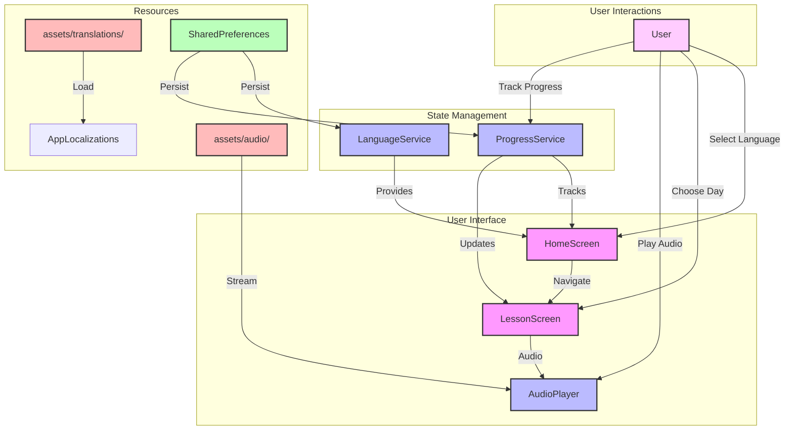
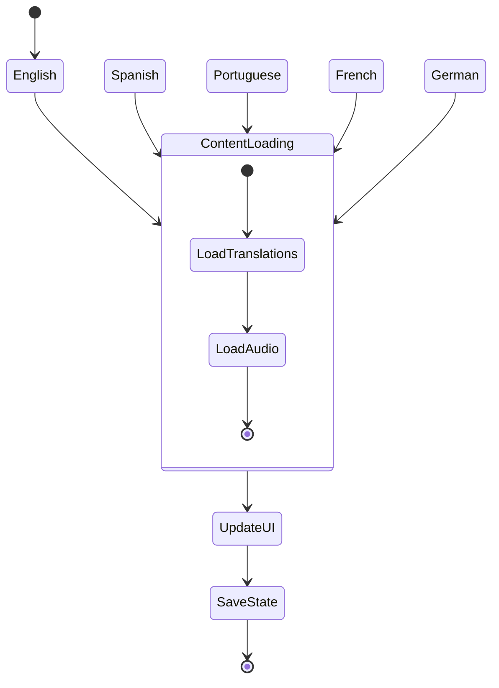
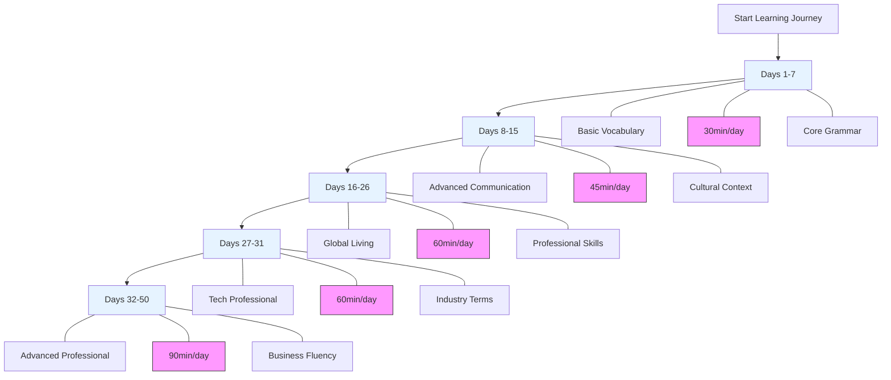

# Polyglot Pathways: Multilingual Learning Platform

[](LICENSE)
[](https://github.com/dbsectrainer/PolyglotPathways/actions/workflows/ci.yml)
[](https://github.com/dbsectrainer/PolyglotPathways)

## Overview
Polyglot Pathways is an innovative, cross-platform Flutter mobile application designed to facilitate comprehensive language learning across five languages: English, Spanish, Portuguese, French, and German. The platform offers a structured 50-day program that combines modern mobile development with sophisticated internationalization techniques.

## Project Structure


```
polyglot-pathways/
│
├── lib/                           # Flutter source code
│   ├── main.dart                 # App entry point with multi-provider setup
│   │
│   ├── models/                   # Data models
│   │   ├── language.dart        # Language enum and properties
│   │   ├── lesson.dart          # Lesson data model
│   │   ├── progress.dart        # User progress tracking
│   │   ├── achievement.dart     # Achievement definitions (NEW)
│   │   └── streak.dart          # Streak tracking model (NEW)
│   │
│   ├── screens/                  # UI screens
│   │   ├── onboarding_screen.dart        # 4-page onboarding (NEW)
│   │   ├── main_navigation_screen.dart   # Bottom nav container (NEW)
│   │   ├── home_screen.dart              # Enhanced home with stats (UPDATED)
│   │   ├── lesson_screen.dart            # Enhanced audio player (UPDATED)
│   │   ├── profile_screen.dart           # User profile & stats (NEW)
│   │   ├── achievements_screen.dart      # Achievement gallery (NEW)
│   │   └── settings_screen.dart          # App settings (NEW)
│   │
│   ├── widgets/                  # Reusable widgets
│   │   ├── language_card.dart
│   │   ├── course_structure.dart
│   │   └── day_grid.dart
│   │
│   ├── services/                 # Business logic
│   │   ├── language_service.dart         # UI language management
│   │   ├── progress_service.dart         # Lesson progress tracking
│   │   ├── settings_service.dart         # App settings (NEW)
│   │   └── gamification_service.dart     # Achievements & streaks (NEW)
│   │
│   ├── theme/                    # Theme configuration (NEW)
│   │   └── app_theme.dart       # Light/dark themes, colors, styles
│   │
│   └── utils/                    # Utilities
│       └── app_localizations.dart
│
├── assets/                       # Application assets
│   ├── audio/                   # Multilingual audio content
│   │   └── day*_*.mp3          # 250 audio files (50 days × 5 languages)
│   ├── translations/            # Language resource files
│   │   ├── en.json             # English UI translations
│   │   ├── es.json             # Spanish UI translations
│   │   ├── pt.json             # Portuguese UI translations
│   │   ├── fr.json             # French UI translations
│   │   ├── de.json             # German UI translations
│   │   └── day.*.json          # Lesson-specific translations
│   └── lessons/                 # Lesson text content
│
├── android/                     # Android platform code
├── ios/                         # iOS platform code
├── web/                         # Web platform code
│
├── pubspec.yaml                # Flutter dependencies
└── language_phrases_days_*.py  # Content generation scripts
```

### Key Architecture Components

#### New Files Added (UI/UX Overhaul)
- **7 new screens**: Onboarding, MainNavigation, Profile, Achievements, Settings
- **2 new models**: Achievement, Streak
- **2 new services**: SettingsService, GamificationService
- **1 new theme system**: Comprehensive light/dark theme configuration

#### Updated Files
- **main.dart**: Multi-provider setup, theme switching, onboarding logic
- **home_screen.dart**: Streak display, daily goals, enhanced stats
- **lesson_screen.dart**: Speed control, loop mode, achievement notifications

## Key Technologies and Skills Demonstrated

### 1. Flutter Mobile Development
- Cross-platform mobile application (Android, iOS, Web)
- Modern Material Design 3 UI
- Responsive, mobile-first design
- Provider state management
- SharedPreferences for data persistence

### 2. Internationalization (i18n)
- Dynamic multilingual support
- Seamless language switching
- Comprehensive translation management
- Support for 5 languages:
  - 🇬🇧 English
  - 🇪🇸 Spanish
  - 🇧🇷 Portuguese
  - 🇫🇷 French
  - 🇩🇪 German


### 3. Educational Technology
- Structured 50-day learning curriculum
- Progressive learning path
- Interactive lesson interfaces
- Multimedia learning approach (text + audio)

### 4. Content Generation
- Python-based content generation scripts
- Systematic content organization
- Scalable content management

### 5. Audio Processing
- Multilingual audio file management
- Text-to-speech integration
- Cross-language audio content

## Course Structure



### Learning Phases
1. **Basic Vocabulary (Days 1-7)**
   - Fundamental communication skills
   - Core grammar and phrases

2. **Advanced Communication (Days 8-15)**
   - Professional and cultural expressions
   - Complex conversation techniques

3. **Global Living (Days 16-26)**
   - Professional and daily life vocabulary
   - Cross-cultural communication skills

4. **Tech Professional Content (Days 27-31)**
   - Industry-specific terminology
   - Digital communication skills

5. **Advanced Professional Skills (Days 32-50)**
   - Academic and business communication
   - Complex negotiation techniques

## Technical Requirements
- Flutter SDK 3.0.0 or higher
- Dart SDK 3.0.0 or higher
- Android Studio / Xcode (for mobile development)
- A physical device or emulator

## Development Setup

### 1. Install Flutter
Follow the official Flutter installation guide for your operating system:
https://docs.flutter.dev/get-started/install

### 2. Clone the Repository
```bash
git clone https://github.com/dbsectrainer/PolyglotPathways.git
cd PolyglotPathways
```

### 3. Install Dependencies
```bash
flutter pub get
```

### 4. Run the Application

#### For Android
```bash
flutter run -d android
```

#### For iOS
```bash
flutter run -d ios
```

#### For Web
```bash
flutter run -d chrome
```

### 5. Build for Production

#### Android APK
```bash
flutter build apk --release
```

#### iOS
```bash
flutter build ios --release
```

#### Web
```bash
flutter build web --release
```

## Features

### 🎨 Modern UI/UX (Industry-Standard Design)
- **Bottom Navigation**: 4-tab navigation (Home, Achievements, Profile, Settings)
- **Onboarding Flow**: Beautiful welcome screens with smooth animations
- **Dark Mode**: Full dark theme support with automatic switching
- **Accessibility**: Text scaling (0.85x - 1.3x), high contrast, screen reader support
- **Animations**: Smooth transitions and micro-interactions using flutter_animate
- **Material Design 3**: Modern, polished interface following latest design guidelines

### 🎮 Gamification System
- **Achievements**: 17 unique achievements across 4 categories
  - Lesson milestones (First Lesson, 10/25/50 lessons completed)
  - Streak rewards (7, 14, 30, 100 day streaks)
  - Multilingual badges (Bronze, Silver, Gold polyglot)
  - Special achievements (Early Bird, Night Owl, Speed Learner)
- **Streak Tracking**: Daily learning streak with longest streak record
- **Progress Visualization**: Interactive charts showing progress across all languages
- **Daily Goals**: Customizable daily lesson targets (1-10 lessons/day)
- **Achievement Notifications**: Celebrate unlocks with confetti and snackbars

### 🎵 Enhanced Audio Player
- **Playback Speed Control**: 0.5x to 2.0x speed (6 preset speeds)
- **Repeat/Loop Mode**: Continuous playback for practice
- **Quick Navigation**: 10-second forward/backward buttons
- **Restart Function**: One-tap restart to beginning
- **Progress Slider**: Precise seeking to any position
- **Real-time Duration**: Current position and total duration display

### 📊 Advanced Progress Tracking
- **Multi-Language Dashboard**: Track progress across all 5 languages
- **Interactive Charts**: Bar charts showing lessons completed per language
- **Streak Visualization**: Current streak, longest streak, total lessons
- **Daily Goal Progress**: Real-time progress toward daily targets
- **Recent Activity**: Timeline of recent achievements and completions
- **Overall Statistics**: Comprehensive stats on profile screen

### 🎯 Profile & Settings
- **User Profile**: Personal stats, achievement count, language progress
- **Customizable Settings**:
  - Dark/Light theme toggle
  - Text size adjustment (4 presets)
  - Daily goal configuration
  - Sound effects toggle
  - Notification preferences
  - Interface language selection
- **Data Management**: Reset settings or progress options
- **Tutorial Access**: Re-view onboarding anytime

### 🌐 Core Features
- Cross-platform mobile application (Android, iOS, Web)
- Progress tracking with local persistence
- Multilingual content in 5 languages
- High-quality audio playback with advanced controls
- Responsive design optimized for mobile devices
- SharedPreferences-based session persistence
- Offline-first architecture
- Provider-based state management
- Custom internationalization system

### 📱 Navigation Structure
```
App Entry
├── Onboarding (First Launch)
│   └── 4-screen tutorial with animations
└── Main Navigation (Bottom Tabs)
    ├── Home Tab
    │   ├── Streak display
    │   ├── Daily goal tracker
    │   ├── Language selection cards
    │   └── Day grid for selected language
    ├── Achievements Tab
    │   ├── Progress header (X/17 unlocked)
    │   ├── Category tabs (All, Lessons, Streaks, Languages, Special)
    │   └── Achievement cards with unlock status
    ├── Profile Tab
    │   ├── Profile header with streak
    │   ├── Statistics overview (4 stat cards)
    │   ├── Progress by language (bar chart)
    │   └── Recent activity timeline
    └── Settings Tab
        ├── Appearance (dark mode, text size)
        ├── Learning (daily goal, hints)
        ├── Audio & Sound (effects toggle)
        ├── Notifications (reminders)
        ├── Interface Language
        └── Data Management
```

## Global Impact
- Communicate with ~2 billion people
- Access to international job markets
- Enhanced cross-cultural communication skills

## License
This project is licensed under the MIT License - see the [LICENSE](LICENSE) file for details.

## Contributing
We welcome contributions! Please see our [Contributing Guidelines](CONTRIBUTING.md) for details on:
- Reporting bugs
- Suggesting enhancements
- Code contributions
- Documentation improvements
- Translation contributions
- Pull request process

All contributors must adhere to our [Code of Conduct](CODE_OF_CONDUCT.md).

## 👤 Author & Maintainer

This repository is maintained by [Donnivis Baker](https://github.com/dbsectrainer). For questions or feedback, please open an issue or reach out directly.
