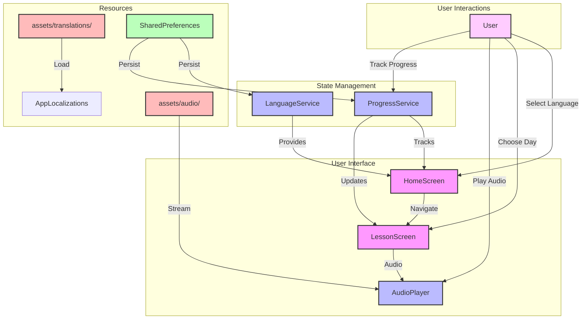
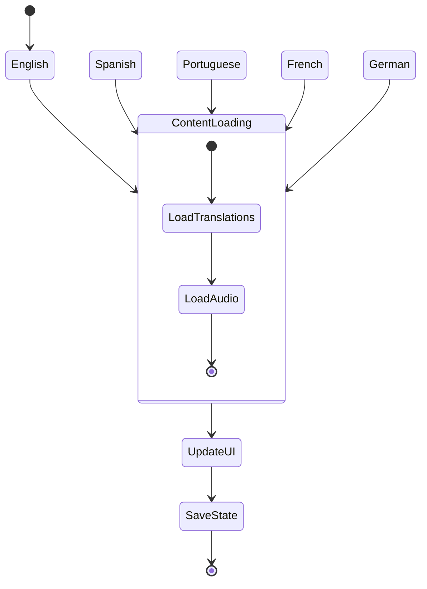
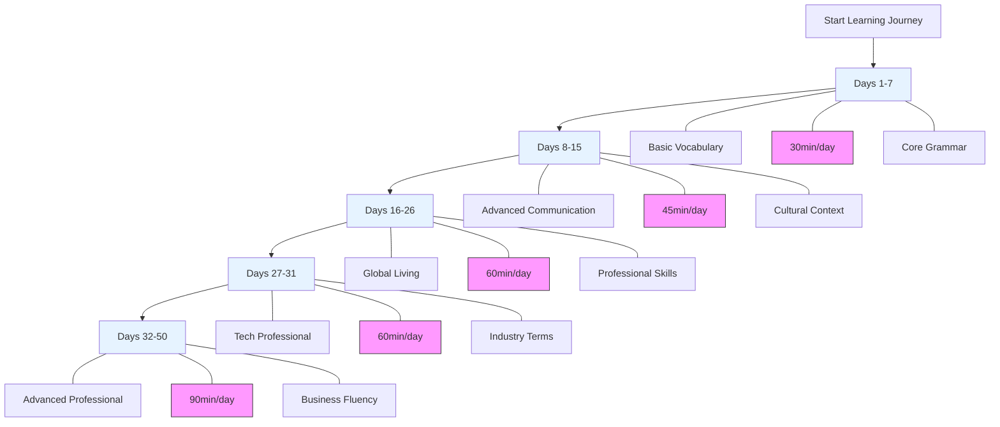
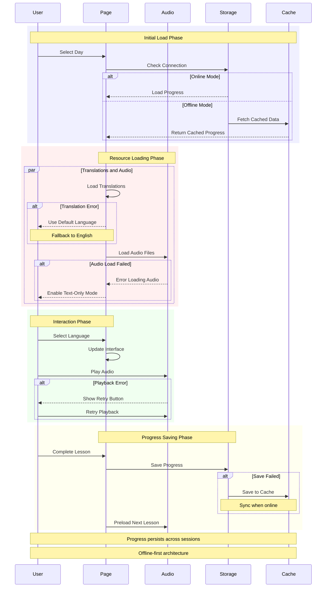

# Polyglot Pathways: Multilingual Learning Platform

[](LICENSE)
[](https://github.com/dbsectrainer/PolyglotPathways/actions/workflows/ci.yml)
[](https://github.com/dbsectrainer/PolyglotPathways)

## Overview
Polyglot Pathways is an innovative, cross-platform Flutter mobile application designed to facilitate comprehensive language learning across five languages: English, Spanish, Portuguese, French, and German. The platform offers a structured 50-day program that combines modern mobile development with sophisticated internationalization techniques.

## Project Structure


```
polyglot-pathways/
│
├── lib/                    # Flutter source code
│   ├── main.dart          # App entry point
│   ├── models/            # Data models
│   │   ├── language.dart
│   │   ├── lesson.dart
│   │   └── progress.dart
│   ├── screens/           # UI screens
│   │   ├── home_screen.dart
│   │   └── lesson_screen.dart
│   ├── widgets/           # Reusable widgets
│   │   ├── language_card.dart
│   │   ├── course_structure.dart
│   │   └── day_grid.dart
│   ├── services/          # Business logic
│   │   ├── language_service.dart
│   │   └── progress_service.dart
│   └── utils/             # Utilities
│       └── app_localizations.dart
│
├── assets/                # Application assets
│   ├── audio/            # Multilingual audio content
│   │   └── day*_*.mp3   # Audio files for each day and language
│   └── translations/     # Language resource files
│       └── *.json
│
├── android/              # Android platform code
├── ios/                  # iOS platform code
├── web/                  # Web platform code
│
├── pubspec.yaml         # Flutter dependencies
└── language_phrases_days_*.py  # Content generation scripts
```

## Key Technologies and Skills Demonstrated

### 1. Flutter Mobile Development
- Cross-platform mobile application (Android, iOS, Web)
- Modern Material Design 3 UI
- Responsive, mobile-first design
- Provider state management
- SharedPreferences for data persistence

### 2. Internationalization (i18n)
- Dynamic multilingual support
- Seamless language switching
- Comprehensive translation management
- Support for 5 languages:
  - 🇬🇧 English
  - 🇪🇸 Spanish
  - 🇧🇷 Portuguese
  - 🇫🇷 French
  - 🇩🇪 German


### 3. Educational Technology
- Structured 50-day learning curriculum
- Progressive learning path
- Interactive lesson interfaces
- Multimedia learning approach (text + audio)

### 4. Content Generation
- Python-based content generation scripts
- Systematic content organization
- Scalable content management

### 5. Audio Processing
- Multilingual audio file management
- Text-to-speech integration
- Cross-language audio content

## Course Structure



### Learning Phases
1. **Basic Vocabulary (Days 1-7)**
   - Fundamental communication skills
   - Core grammar and phrases

2. **Advanced Communication (Days 8-15)**
   - Professional and cultural expressions
   - Complex conversation techniques

3. **Global Living (Days 16-26)**
   - Professional and daily life vocabulary
   - Cross-cultural communication skills

4. **Tech Professional Content (Days 27-31)**
   - Industry-specific terminology
   - Digital communication skills

5. **Advanced Professional Skills (Days 32-50)**
   - Academic and business communication
   - Complex negotiation techniques

## Technical Requirements
- Flutter SDK 3.0.0 or higher
- Dart SDK 3.0.0 or higher
- Android Studio / Xcode (for mobile development)
- A physical device or emulator

## Development Setup

### 1. Install Flutter
Follow the official Flutter installation guide for your operating system:
https://docs.flutter.dev/get-started/install

### 2. Clone the Repository
```bash
git clone https://github.com/dbsectrainer/PolyglotPathways.git
cd PolyglotPathways
```

### 3. Install Dependencies
```bash
flutter pub get
```

### 4. Run the Application

#### For Android
```bash
flutter run -d android
```

#### For iOS
```bash
flutter run -d ios
```

#### For Web
```bash
flutter run -d chrome
```

### 5. Build for Production

#### Android APK
```bash
flutter build apk --release
```

#### iOS
```bash
flutter build ios --release
```

#### Web
```bash
flutter build web --release
```

## Features


- Cross-platform mobile application (Android, iOS, Web)
- Beautiful Material Design 3 UI
- Progress tracking with local persistence
- Multilingual content in 5 languages
- High-quality audio playback with controls (play/pause, seek, 10s forward/backward)
- Responsive design optimized for mobile devices
- SharedPreferences-based session persistence
- Offline-first architecture
- Provider-based state management
- Custom internationalization system

## Global Impact
- Communicate with ~2 billion people
- Access to international job markets
- Enhanced cross-cultural communication skills

## License
This project is licensed under the MIT License - see the [LICENSE](LICENSE) file for details.

## Contributing
We welcome contributions! Please see our [Contributing Guidelines](CONTRIBUTING.md) for details on:
- Reporting bugs
- Suggesting enhancements
- Code contributions
- Documentation improvements
- Translation contributions
- Pull request process

All contributors must adhere to our [Code of Conduct](CODE_OF_CONDUCT.md).

## 👤 Author & Maintainer

This repository is maintained by [Donnivis Baker](https://github.com/dbsectrainer). For questions or feedback, please open an issue or reach out directly.
