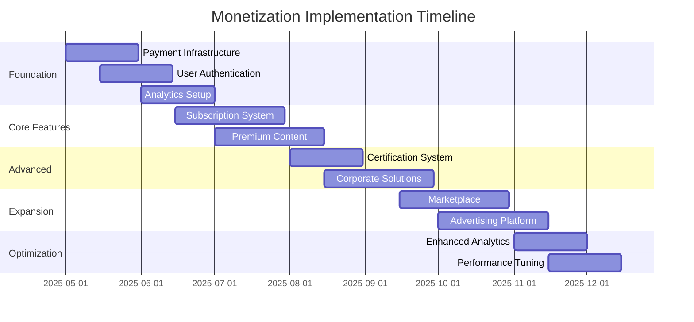

# Polyglot Pathways Monetization Roadmap

## Overview
This technical roadmap outlines the development phases and infrastructure requirements for implementing monetization features in Polyglot Pathways. The plan is structured to minimize initial development overhead while maximizing potential revenue streams.

## Phase 1: Foundation (Months 1-2)
### Payment Infrastructure
- [ ] Integrate Stripe API for payment processing
  - Implement webhook handlers
  - Set up secure payment flow
  - Configure test environment
- [ ] Implement secure user authentication system
  - JWT-based authentication
  - Role-based access control
  - Password reset functionality
- [ ] Create user account management system
  - User profile database schema
  - Subscription status tracking
  - Payment history

### Basic Premium Features
- [ ] Implement content access control system
  - Premium content flags in database
  - Access middleware
  - Premium content indicators in UI
- [ ] Add downloadable resources functionality
  - PDF generation system
  - Audio download management
  - Resource access tracking

### Analytics Foundation
- [ ] Set up analytics infrastructure
  - User behavior tracking
  - Content usage metrics
  - Conversion tracking
  - Revenue analytics dashboard

## Phase 2: Core Monetization (Months 3-4)
### Subscription System
- [ ] Implement tiered subscription plans
  ```json
  {
    "tiers": {
      "basic": {
        "price": "free",
        "features": ["core lessons", "basic progress tracking"]
      },
      "premium": {
        "price": "$9.99/month",
        "features": ["all basic features", "downloadable resources", "premium content"]
      },
      "professional": {
        "price": "$19.99/month",
        "features": ["all premium features", "certification", "priority support"]
      }
    }
  }
  ```
- [ ] Develop subscription management system
  - Automatic billing
  - Plan upgrading/downgrading
  - Cancellation handling

### Premium Content Delivery
- [ ] Create premium content management system
  - Content categorization
  - Access level management
  - Premium content creation tools
- [ ] Implement advanced progress tracking
  - Detailed analytics
  - Achievement system
  - Learning path customization

## Phase 3: Advanced Features (Months 5-6)
### Certification System
- [ ] Develop certification infrastructure
  - Assessment engine
  - Certificate generation
  - Verification system
- [ ] Create digital badge system
  - Badge design system
  - Achievement tracking
  - Social sharing integration

### Corporate Solutions
- [ ] Build bulk licensing system
  - Multi-user management
  - Usage reporting
  - Custom branding options
- [ ] Implement organization management
  - Team progress tracking
  - Admin dashboard
  - Usage analytics

## Phase 4: Monetization Expansion (Months 7-8)
### Marketplace Development
- [ ] Create digital product marketplace
  - Product catalog system
  - Digital delivery system
  - Review/rating system
- [ ] Implement affiliate system
  - Affiliate tracking
  - Commission calculation
  - Payment distribution

### Advertising Platform
- [ ] Develop ad management system
  - Ad placement engine
  - Targeting system
  - Performance tracking
- [ ] Create sponsored content platform
  - Content submission system
  - Review process
  - Analytics tracking

## Phase 5: Advanced Analytics & Optimization (Months 9-10)
### Enhanced Analytics
- [ ] Implement advanced analytics
  - User segmentation
  - Cohort analysis
  - Revenue optimization
  - Churn prediction
- [ ] Create A/B testing framework
  - Test management
  - Results tracking
  - Automated optimization

### Performance Optimization
- [ ] Optimize payment flows
  - Reduce friction
  - Improve conversion
  - Enhanced security
- [ ] Implement caching strategies
  - Content delivery optimization
  - Response time improvement
  - Resource optimization

## Technical Requirements

### Infrastructure
- Cloud hosting (AWS/GCP)
- CDN for content delivery
- Load balancing
- Auto-scaling configuration

### Security
- SSL/TLS encryption
- Data encryption at rest
- Regular security audits
- GDPR compliance
- PCI DSS compliance

### Database
- User management system
- Content management system
- Transaction history
- Analytics data store

### API Requirements
- RESTful API design
- GraphQL for complex queries
- API versioning
- Rate limiting
- Authentication/Authorization

### Monitoring
- System health monitoring
- Performance metrics
- Error tracking
- User behavior analytics

## Success Metrics
- Monthly Recurring Revenue (MRR)
- User Conversion Rate
- Customer Lifetime Value (CLV)
- Churn Rate
- Average Revenue Per User (ARPU)
- Feature Usage Statistics
- User Satisfaction Score

## Risk Mitigation
- Regular security audits
- Data backup and recovery plans
- Performance monitoring
- User feedback collection
- A/B testing for major changes
- Gradual feature rollout

## Future Considerations
- Mobile app development
- Additional language support
- AI-powered personalization
- Virtual classroom features
- Live tutoring integration
- Community features
- Gamification elements

## Implementation Guidelines
1. Follow agile development methodology
2. Implement continuous integration/deployment
3. Maintain comprehensive documentation
4. Regular security reviews
5. Performance optimization
6. User feedback integration
7. Regular stakeholder updates

## Timeline Overview


This roadmap serves as a living document and should be updated as requirements evolve and new opportunities are identified. Regular reviews and adjustments will ensure alignment with business goals and user needs.
